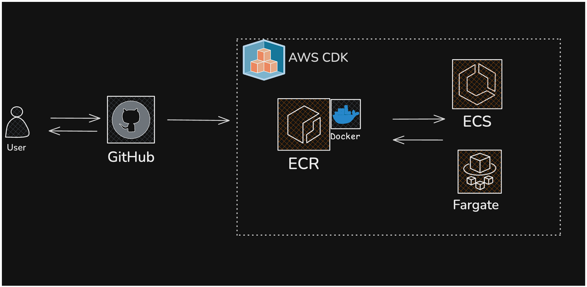

# Deploying a Containerized NodeJs Application using AWS CDK, AWS ECR, ECS (Fargate) and Docker

## GitHub repo

https://github.com/nirgluzman/AWS-CDK-Containerized-App.git

## Architecture



## Project setup

### Initialize a new CDK project:

```bash
cdk init app --language=typescript
```

### Project structure:

```tree
containerized-app
├── bin
│   └── containerized-app.ts
├── lib
│   └── containerized-app-stack.ts
├── package.json
├── tsconfig.json
└── README.md
```

- `bin/`: Contains the entry point for our CDK app.
- `lib/`: This is where we define our cloud resources.
- `package.json`: Lists dependencies for our application (for TypeScript).
- `cdk.json`: Configuration for our CDK app.

## CDK Bootstrapping

https://docs.aws.amazon.com/cdk/v2/guide/bootstrapping.html
https://docs.aws.amazon.com/cdk/v2/guide/bootstrapping-env.html

- Bootstrapping prepares your AWS environment by provisioning specific AWS resources in your
  environment that are used by the AWS CDK. These resources are commonly referred to as your
  bootstrap resources.

```bash
cdk bootstrap
```

## Environments for the AWS CDK

https://docs.aws.amazon.com/cdk/v2/guide/environments.html

- An environment consists of the AWS account and AWS Region that you deploy an AWS CDK stack to.
- You can pass environment information from these files in your CDK code through environment
  variables that are provided by the CDK.
- The following is an example of specifying these environment variables in your CDK code:

```js
new MyDevStack(app, 'dev', {
  env: {
    account: process.env.CDK_DEFAULT_ACCOUNT,
    region: process.env.CDK_DEFAULT_REGION,
  },
});
```

## Create AWS ECR repository if it doesn't exist (AWS CLI)

https://stackoverflow.com/questions/51028677/create-aws-ecr-repository-if-it-doesnt-exist

- AWS creates a repository only if it doesn't exist.

```bash
aws ecr create-repository --repository-name <repo_name> || true
```

## Pushing a Docker image to an Amazon ECR private repository

https://docs.aws.amazon.com/AmazonECR/latest/userguide/docker-push-ecr-image.html

1. Authenticate Docker client to the Amazon ECR registry to which you intend to push your image.

```bash
aws ecr get-login-password --region <REGION> | docker login --username AWS --password-stdin <ACCOUNT_ID>.dkr.ecr.<REGION>.amazonaws.com
```

2. Tag the image with the Amazon ECR registry, repository, and optional image tag name combination
   to use.

```bash
docker tag my-node-app <ACCOUNT_ID>.dkr.ecr.<REGION>.amazonaws.com/<REPOSITORY_NAME>
```

3. Push the image using the `docker push` command:

```bash
docker push <ACCOUNT_ID>.dkr.ecr.<REGION>.amazonaws.com/<REPOSITORY_NAME>
```

4. (Optional) Apply any additional tags to the image and push those tags to Amazon ECR.

## Configuring OpenID Connect in AWS (for GitHub Actions)

https://docs.github.com/en/actions/security-for-github-actions/security-hardening-your-deployments/configuring-openid-connect-in-amazon-web-services

- OpenID Connect (OIDC) allows your GitHub Actions workflows to access resources in AWS, without
  needing to store the AWS credentials as long-lived GitHub secrets.
